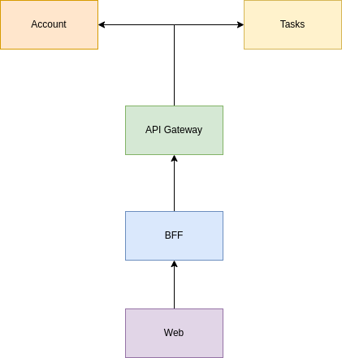
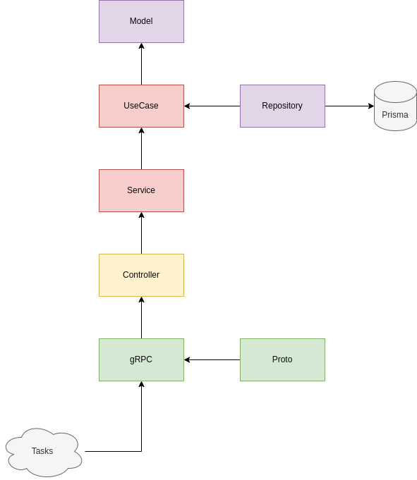

# Manager tasks

Sistema para gerenciamento de tarefas.

## Sistemas

Com a intenção de construir uma solução distribuida que se comunique utilizando gRPC e REST, foi pensado nos sistemas a seguir.

### Account

Sistema que irá gerenciar as contas registadas no sistema. Sua principal função será gerenciar uma conta, ou seja, irá:

- Registar uma nova conta com as informações como nome do cliente, _username_ e senha para login.
- Atualizar as informações.
- Cancelar uma conta.

Sua principal estrutura pode ser demonstrada abaixo:

