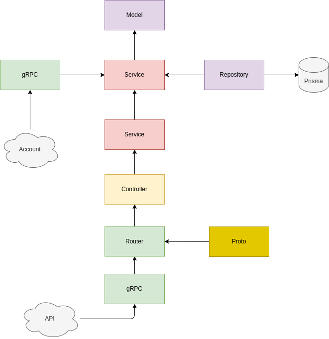

# gTasks

Sistema para gerenciamento de tarefas.


## Sistemas

Com a intenção de construir uma solução distribuida que se comunique utilizando gRPC e REST, foi pensado nos sistemas a seguir.

### Account

Sistema que irá gerenciar as contas registadas no sistema. Sua principal função será gerenciar uma conta, ou seja, irá:

- Registar uma nova conta com as informações do nome e avatar do cliente.
- Atualizar as informações.
- Cancelar uma conta.

Sua principal estrutura pode ser demonstrada abaixo:


### Tasks

Sistema que irá gerenciar as tarefas dos usuários, tendo como principais funções:

- Registrar uma nova atividade informando uma descrição para a atividade, o id e o nome do cliente.
- Atualizar se a atividade foi concluída
- Excluir a atividade

Sua principal estrutura pode ser demonstrada abaixo:



### API

Sistema que servirá como uma camada de interface entre as informações vindas do frontend, mas também irá orquestar os sistemas de _account_ e _tasks_.

Além disso, irá garantir que só receberá requisições do domínio referente ao frontend.


### Web

Sistema que será responsável tanto pela visualização quanto da comunicação com a _API_. As funções serão:

- Autenticação via Github
- Listagem das atividades do usuário logado
- Formulário para criação de uma nova atividade
- Ação de concluir uma atividade
- Ação de excluir uma atividade

**Login**


**Listagem**


### BFF

Sistema simples que faz intermedio entre a API e a aplicação Web, possibilitando que exista uma comunicação, mas também seja possível realizar tratativas no meio do caminho.

Para facilitar, esse sistema estará imbutido ao framework Next na parte de api que ele fornece, facilitando também acessos.

## Organização do projeto

O projeto está seguindo o padrão do monorepo, e como framework o [turborepo](https://turborepo.org/) da Vercel.
A principal motivação para utilizar desse padrão é a facilidade de organização de projetos auxiliares que
facilmente se comunicam entre os projetos, por exemplo o projeto de lint que fica compartilhado para todos os projetos de aplicação sem precisar configurar essa parte neles.

Além do aspecto organizacional, onde todos os projeto estarão em um único repositório e conseguirem conversar entre si,
um outro motivo foi a facilidade de criação de novos projetos.


### Outras tecnologias

Nesse projeto está sendo utilizado:

- gRPC: comunicação entre as aplicações _Account_ e _Tasks_
- REST: comunicação entre as aplicações _Web_ e _Api_
- NextJS: gerenciamento do frontend (telas, rotas) e do _BFF_
- Typescript: Linguagem base uitilizada em todas as aplicações
- Turborepo: sistema de gerenciamento entre aplicações
- Prisma (ORM): gerenciamento do banco de dados e interface de comunicação
- Jest: geração dos testes de todas as aplicações

### Preview


## Getting Started

Instalação das dependências

```
yarn install
```

Inicialização dos databases
```
yarn setup
```

Rodar o projeto

```
yarn dev
```
ou
```
yarn start
```

Acessar: http://localhost:3000

**With Docker**

Construir a imagem
```
docker-compose build
```

Inicializar os databases

```
docker-compose rum --rm tasks yarn setup
```

Rodar os projetos
```
docker-compose up
```

Acessar: http://localhost:3000