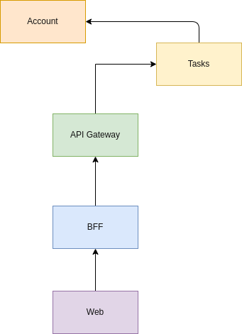
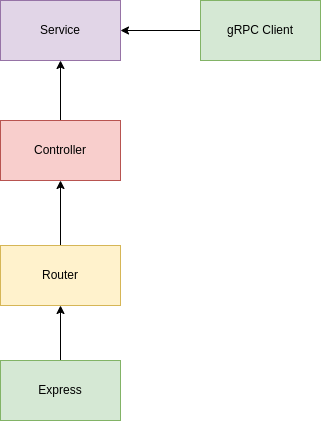

# Manager tasks

Sistema para gerenciamento de tarefas.

## Sistemas

Com a intenção de construir uma solução distribuida que se comunique utilizando gRPC e REST, foi pensado nos sistemas a seguir.

### Account

Sistema que irá gerenciar as contas registadas no sistema. Sua principal função será gerenciar uma conta, ou seja, irá:

- Registar uma nova conta com as informações do nome e avatar do cliente.
- Atualizar as informações.
- Cancelar uma conta.

Sua principal estrutura pode ser demonstrada abaixo:

### Tasks

Sistema que irá gerenciar as atividades dos usuários, tendo como principais funções:

- Registrar uma nova atividade informando uma descrição para a atividade, o id e o nome do cliente.
- Atualizar se a atividade foi concluída
- Excluir a atividade

Sua principal estrutura pode ser demonstrada abaixo:

### API

Sistema que servirá como uma camada de interface entre as informações vindas do frontend, mas também irá orquestar os sistemas de _account_ e _tasks_.

Além disso, irá garantir que só receberá requisições do domínio referente ao frontend.

### Web

Sistema que será responsável tanto pela visualização quanto da comunicação com a _API_. As funções serão:

- Autenticação via Github
- Listagem das atividades do usuário logado
- Formulário para criação de uma nova atividade
- Ação de concluir uma atividade
- Ação de excluir uma atividade

**Login**

**Listagem**

